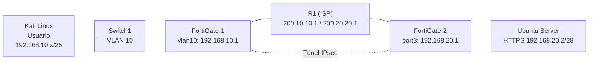

# VPN IPsec Site-to-Site con FortiGate

Laboratorio de Seguridad de Redes: comunicación segura entre un usuario y un servidor web HTTPS a través de una VPN IPsec Site-to-Site entre dos FortiGate, configurados por GUI.

## Video demostrativo

▶️ **[Ver el video en YouTube](https://youtu.be/9Xed9aEGIpY)**

---

## Propósito del laboratorio

Comunicar a un usuario (Kali Linux, en la VLAN 10) con un servidor web (Ubuntu Server con Apache2 y HTTPS) a través de un enlace VPN IPsec Site-to-Site entre dos FortiGate, usando un router que actúa como ISP con direcciones IP públicas.

Como el ISP no conoce las redes privadas (192.168.x.x), el tráfico entre el usuario y el servidor solo tiene camino cuando el túnel VPN está activo.

### Objetivos

- Comunicar el usuario con el servidor a través del enlace VPN.
- Comprobar que la comunicación solo fluye si el enlace VPN está activo.
- Configurar en ambos FortiGate (todo por GUI): red, NAT y VPN Site-to-Site.
- Configurar el ISP con IP públicas.
- Publicar un servidor web con HTTPS en una red /28.
- Configurar la red de usuarios /25 en VLAN 10 con DHCP y verificar la ruta con traceroute.

---

## Topología

Port1 de cada FortiGate está conectado a un nodo Cloud (Cloud1 / Cloud2) y se usa solo para acceder a la GUI.

## Direccionamiento

| Enlace / Red | Red | Extremo A | Extremo B |
|---|---|---|---|
| FG1 Port2 - R1 f0/0 | 200.10.10.0/30 | FG1: 200.10.10.2 | R1: 200.10.10.1 |
| FG2 Port2 - R1 g1/0 | 200.20.20.0/30 | FG2: 200.20.20.2 | R1: 200.20.20.1 |
| LAN usuarios (VLAN 10) | 192.168.10.0/25 | FG1 vlan10: 192.168.10.1 | Kali: DHCP (.10 a .100) |
| LAN servidor | 192.168.20.0/28 | FG2 port3: 192.168.20.1 | Ubuntu Server: 192.168.20.2 |

## Tecnologías

GNS3, VMware, FortiGate VM 7.0.9, Cisco IOS (R1), Kali Linux, Ubuntu Server, Apache2.

---

## Qué se configuró

- **R1 (ISP):** direccionamiento público en f0/0 y g1/0.
- **FortiGate-1:** interfaz WAN, interfaz vlan10 con servidor DHCP, ruta por defecto, política de salida con NAT y política de VPN sin NAT.
- **FortiGate-2:** interfaz WAN, interfaz LAN del servidor, ruta por defecto, política de salida con NAT y política de VPN sin NAT.
- **VPN IPsec Site-to-Site:** creada con el asistente de la GUI entre FG1 y FG2.
- **Servidor web:** IP estática con Netplan y HTTPS habilitado en Apache2.
- **Usuario:** Kali Linux en la VLAN 10 (Switch1: puerto access VLAN 10 hacia Kali y trunk dot1q hacia FG1), con IP por DHCP.

## Pruebas

- Ping desde FG1 (con origen 192.168.10.1) y desde Kali hacia el servidor `192.168.20.2` a través del túnel, con TTL 62 desde Kali (dos saltos: FG1 y FG2).
- Kali recibe `192.168.10.10/25` por DHCP desde FG1, con gateway `192.168.10.1`.
- El túnel aparece con fase 1 y fase 2 activas en *Monitor > IPsec Monitor*.

Las capturas de cada prueba están en el PDF de documentación.

## Problemas encontrados y soluciones

1. **Ruta por defecto por DHCP en Port1.** Port1 (modo DHCP, usado para gestión) instalaba una ruta por defecto con distancia 5, que ganaba a la ruta estática por port2 (distancia 10). Solución: desactivar *Retrieve default gateway from server* en port1.
2. **La etiqueta VLAN 10 no llegaba a FG1.** Kali enviaba tramas con 802.1Q (comprobado con `tcpdump -e`), pero FG1 las recibía sin etiqueta (volcado hexadecimal en port3). Solución: colocar un switch en GNS3 entre Kali y FG1 que asigna la VLAN 10.
3. **El túnel se levanta solo.** Con Auto-negotiate activo, el túnel se renegocia al recibir tráfico, por lo que *Bring Down* no basta para una demostración con el túnel caído.

## Contenido del repositorio

| Elemento | Descripción |
|---|---|
| `01-Link-video` | Enlace al video demostrativo |
| `Documentacion_VPN-site-to-site_FortiGate.pdf` | Documentación completa con imágenes y diagramas |
| `configs/` | Archivos de configuración utilizados |

> No se usaron scripts automatizados. Los FortiGate se configuraron por GUI y el resto de equipos con los comandos y archivos de configuración incluidos en este repositorio.

---

**Autor:** Emmanuel Orlando Rodríguez Núñez - 20250798
**Materia:** Seguridad de Redes
